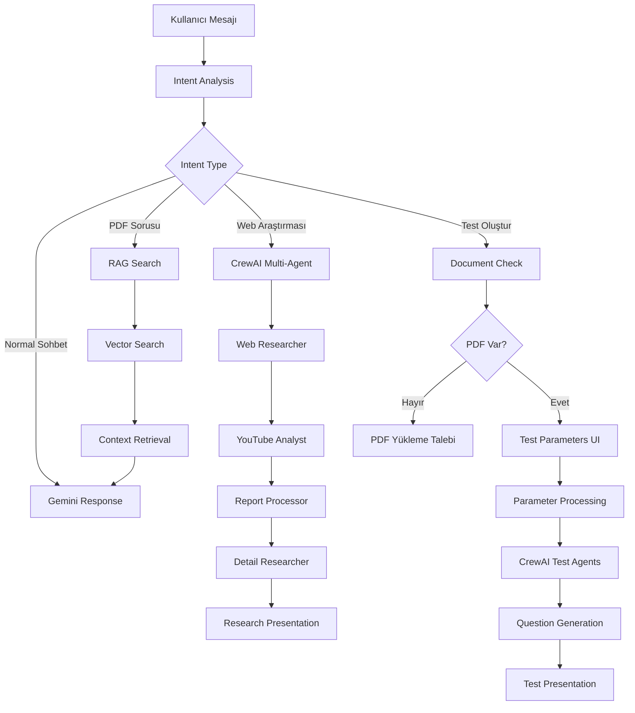
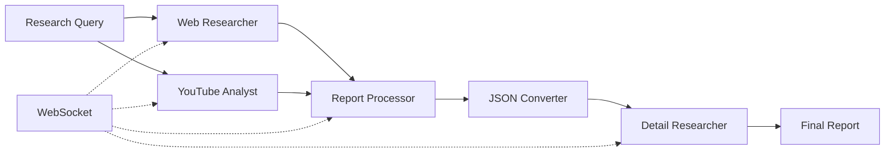
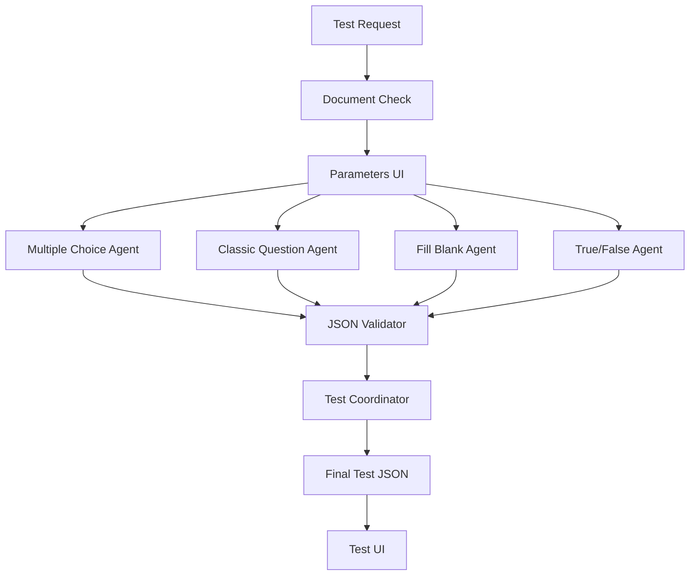

# 🤖 AI-Powered Multi-Agent Research & Chat Platform

> **🚀 JÜRİ İÇİN HIZLI ÇALIŞTIRMA:**
> ```bash
> python run.py
> ```
> 
> **📋 Alternatif Çalıştırma:**
> ```bash
> uvicorn api.server:app --reload --app-dir src
> ```

Bu proje, **CrewAI multi-agent sistemi**, **LangGraph workflow'ları** ve **RAG (Retrieval-Augmented Generation)** teknolojilerini kullanarak gelişmiş bir yapay zeka asistanı platformudur. Web araştırması, PDF analizi, test oluşturma ve gerçek zamanlı sohbet özellikleri sunar.

## 🏆 BTK Hackathon 2025 - Jüri Değerlendirmesi

### ⚡ Hızlı Başlangıç (Jüri İçin)

1. **Projeyi indirin:**
   ```bash
   git clone <repository-url>
   cd hackhaton
   ```

2. **Tek komutla çalıştırın:**
   ```bash
   python run.py
   ```

3. **Tarayıcıda açın:**
   ```
   http://localhost:8000
   ```

### 📝 API Anahtarları (Test İçin)
Script otomatik olarak `.env` dosyası oluşturacak. Test için aşağıdaki API anahtarlarından en az **Google API Key** gerekli:

- **Google API**: [makersuite.google.com](https://makersuite.google.com/app/apikey) (Zorunlu)
- **Serper API**: [serper.dev](https://serper.dev/) (Web araştırması için)

### 🎯 Demo Senaryoları (Jüri Testi)

**1. 🔍 Araştırma Testi:**
```
"2024 yapay zeka trendlerini araştır"
```

**2. 📚 PDF Analizi:**
- PDF yükleyin → "Bu doküman hakkında özet çıkar"

**3. 🎓 Test Oluşturma:**
```
"test oluştur"
```

## 🚀 Temel Özellikler

### 🔍 **Akıllı Araştırma Sistemi**
- **CrewAI Multi-Agent**: 6 farklı uzman agent ile paralel araştırma
  - Web Araştırma Uzmanı
  - YouTube İçerik Analisti
  - Rapor Yapılandırma Uzmanı
  - JSON Dönüştürme Uzmanı
  - Detay Araştırma Uzmanı
  - Veri Yöneticisi
- **Asenkron İşleme**: Tüm agentlar paralel çalışır
- **Otomatik Rapor**: Yapılandırılmış alt başlıklar halinde detaylı raporlar
- **Gerçek Zamanlı İlerleme**: WebSocket üzerinden canlı durum güncellemeleri

### 📚 **RAG (Retrieval-Augmented Generation) Sistemi**
- **PDF Yükleme & Analizi**: Metin tabanlı PDF'leri otomatik işleme
- **OCR Desteği**: Resim ve el yazısı metinlerini okuma (EasyOCR)
- **Vektör Veritabanı**: ChromaDB ile akıllı indeksleme
- **Semantic Search**: Sentence Transformers ile benzerlik arama
- **Chat-Specific Storage**: Her sohbet için izole edilmiş vektör deposu

### 🎓 **Akıllı Test Oluşturma Sistemi**
- **4 Farklı Soru Türü**: 
  - Çoktan Seçmeli (A,B,C,D şıklı)
  - Klasik (Açık uçlu)
  - Boşluk Doldurma
  - Doğru-Yanlış
- **Özelleştirilebilir Parametreler**:
  - Zorluk seviyesi (Kolay, Orta, Zor)
  - Öğrenci seviyesi (Ortaokul, Lise, Üniversite, Yetişkin)
  - Soru sayısı dağılımı (her türden 0-20 arası)
- **CrewAI Test Agentları**: Her soru türü için özel uzman agentlar
- **Otomatik Değerlendirme**: Test sonuçlarını analiz ve eksik konu belirleme
- **LLM Destekli Değerlendirme**: Klasik sorular için AI tabanlı puanlama

### 💬 **Gelişmiş Sohbet Sistemi**
- **Multi-Chat Support**: Çoklu sohbet yönetimi
- **WebSocket**: Gerçek zamanlı iletişim
- **Chat History**: Kalıcı mesaj geçmişi
- **Otomatik Başlık**: AI destekli sohbet başlığı oluşturma
- **PDF Chat Integration**: Her sohbet için özel PDF koleksiyonu

### 🎯 **Intent Analysis & Routing**
- **Akıllı Niyet Analizi**: LangGraph ile otomatik yönlendirme
- **7 Farklı İşlem Türü**:
  - Web Araştırması
  - PDF Sorguları (RAG)
  - Test Oluşturma
  - Normal Sohbet
  - Araştırma Soruları
  - Test Parametreleri
  - Hata Yönetimi

## 🛠️ Teknoloji Stack

### Backend Framework
- **FastAPI**: Modern, hızlı web framework
- **Uvicorn**: ASGI server
- **WebSocket**: Gerçek zamanlı iletişim
- **Python 3.8+**: Core language

### AI/ML Framework'leri
- **LangGraph**: AI workflow orchestration
- **CrewAI**: Multi-agent AI sistemi
- **LangChain**: LLM integration ve RAG
- **Google Gemini 2.5 Flash**: Language model
- **ChromaDB**: Vektör veritabanı
- **Sentence Transformers**: Text embedding (all-MiniLM-L6-v2)

### Doküman İşleme
- **PyPDF2**: PDF metin çıkarma
- **python-docx**: Word doküman desteği
- **EasyOCR**: Optical Character Recognition
- **Pillow**: Resim işleme
- **OpenCV**: Gelişmiş görüntü işleme

### Audio/Video İşleme
- **Faster Whisper**: Audio transcription
- **yt-dlp**: YouTube video indirme
- **WhisperModel**: Ses-metin dönüşümü

### API Entegrasyonları
- **Google API**: Gemini LLM
- **Serper API**: Web arama
- **YouTube API v3**: Video arama ve analiz
- **Brave Search API**: Alternatif web arama

### Frontend
- **Vanilla JavaScript**: Responsive UI
- **WebSocket Client**: Gerçek zamanlı güncellemeler
- **Modern CSS**: Grid & Flexbox layout
- **Font Awesome**: Icon library
- **Google Fonts**: Typography (Inter)

### Veri Yönetimi
- **JSON**: Yapılandırılmış veri depolama
- **File System**: Chat ve PDF yönetimi
- **ChromaDB**: Vektör indeksleme
- **aiofiles**: Asenkron dosya işlemleri

## 📋 Kurulum

### 1. Repository'yi Klonlayın
```bash
git clone https://github.com/kullaniciadi/hackhaton.git
cd hackhaton
```

### 2. Virtual Environment Oluşturun
```bash
python -m venv btk_env
source btk_env/bin/activate  # Linux/Mac
# veya
btk_env\Scripts\activate     # Windows
```

### 3. Bağımlılıkları Yükleyin
```bash
pip install -r requirements.txt
```

### 4. Environment Variables Yapılandırın
`.env` dosyası oluşturun ve API anahtarlarınızı ekleyin:
```env
# Zorunlu API Anahtarları
GOOGLE_API_KEY=your_google_gemini_api_key
SERPER_API_KEY=your_serper_search_api_key

# Opsiyonel API Anahtarları
YOUTUBE_API_KEY=your_youtube_api_v3_key
BRAVE_API_KEY=your_brave_search_api_key
```

**API Anahtarı Alma Rehberi:**
- **Google API**: [Google AI Studio](https://makersuite.google.com/app/apikey)
- **Serper API**: [serper.dev](https://serper.dev/)
- **YouTube API**: [Google Cloud Console](https://console.cloud.google.com/)
- **Brave Search**: [brave.com/search/api/](https://brave.com/search/api/)

### 5. Uygulamayı Başlatın
```bash
cd src
uvicorn api.server:app --reload --app-dir src
```

**Alternatif çalıştırma yöntemleri:**
```bash
# Farklı port ile
uvicorn api.server:app --reload --app-dir src --port 8080

# Tüm IP'lerden erişim
uvicorn api.server:app --reload --app-dir src --host 0.0.0.0

# Production mode
uvicorn api.server:app --app-dir src --workers 4
```

### 6. Tarayıcıda Açın
```
http://localhost:8000
```

## 🔧 Kullanım Rehberi

### 🔍 Web Araştırması Yapma
```
"yapay zeka trendlerini araştır"
"blockchain teknolojisi hakkında detaylı bilgi ver"
"2024 yazılım geliştirme trendleri"
```

**Süreç:**
1. CrewAI Web Araştırma Uzmanı web'de arama yapar
2. YouTube Analisti ilgili videoları bulur ve transkript çıkarır
3. Rapor Uzmanı alt başlıklara böler
4. Detay Uzmanı her konuyu derinleştirir
5. Yapılandırılmış rapor sunulur

### 📚 PDF Analizi
1. **PDF Yükleme**: Sol üstteki "PDF Yükle" butonuna tıklayın
2. **Dosya Seçimi**: PDF dosyanızı seçin (max 50MB)
3. **Otomatik İşleme**: 
   - Metin çıkarma (PyPDF2)
   - OCR analizi (resimli PDF'ler için)
   - Vektörleştirme (ChromaDB)
   - Chunk'lara bölme (1000 karakter, 200 overlap)
4. **Sorgulama**: 
```
"Bu doküman hakkında özet çıkar"
"Bu PDF'de bahsedilen ana konular neler?"
"Dokümandaki örnekleri listele"
```

### 🎓 Test Oluşturma
1. **Test Komutları**:
```
"test oluştur"
"soru hazırla"
"sınav yap"
"quiz oluştur"
```

2. **Parametre Seçimi**: UI'dan aşağıdaki parametreleri seçin:
   - **Soru Türleri**: Hangi türden kaç soru istediğinizi belirleyin
   - **Zorluk Seviyesi**: Kolay, Orta, Zor
   - **Öğrenci Seviyesi**: Ortaokul, Lise, Üniversite, Yetişkin

3. **Test Süreci**:
   - CrewAI Test Agentları devreye girer
   - Her soru türü için özel agent çalışır
   - JSON formatında yapılandırılmış sorular üretilir
   - Otomatik kalite kontrolü yapılır

4. **Test Çözme ve Değerlendirme**:
   - "Testi Çöz" butonuna tıklayın
   - Soruları yanıtlayın
   - Otomatik değerlendirme alın
   - Eksik konularınızı öğrenin

### 💬 Sohbet Yönetimi
- **Yeni Sohbet**: "Yeni Sohbet" butonuyla başlayın
- **Sohbet Geçmişi**: Sol panelden önceki sohbetleri görüntüleyin
- **Sohbet Silme**: Her sohbetin yanındaki çöp kutusu ikonu
- **Otomatik Başlık**: İlk mesajınıza göre AI otomatik başlık oluşturur

## 📁 Proje Yapısı

```
hackhaton/
├── src/                           # Ana kaynak kod
│   ├── api/
│   │   └── server.py             # FastAPI uygulaması
│   ├── agents/
│   │   ├── research_crew.py      # CrewAI araştırma sistemi
│   │   └── crew_agents.py        # Test oluşturma agentları
│   ├── core/
│   │   ├── conversation.py       # LangGraph workflow
│   │   ├── vector_store.py       # ChromaDB entegrasyonu
│   │   ├── chat_manager.py       # Chat yönetimi
│   │   ├── config.py            # Konfigürasyon
│   │   └── document_processor.py # PDF/OCR işleme
│   └── tools/
│       ├── custom_tools.py       # CrewAI özel araçları
│       └── tools.py             # Test araçları
├── static/                       # Frontend dosyaları
│   ├── css/
│   │   ├── main.css             # Ana stil dosyası
│   │   ├── components/          # Bileşen stilleri
│   │   └── test-styles.css      # Test UI stilleri
│   └── js/
│       ├── main.js              # Ana JavaScript
│       ├── core/
│       │   ├── WebSocketHandler.js
│       │   ├── ChatHistoryManager.js
│       │   └── TestManager.js
│       └── pdf-manager.js       # PDF yönetimi
├── chat_data/                   # Sohbet verileri
│   ├── chats_metadata.json     # Sohbet meta verileri
│   └── [chat-id]/              # Her sohbet için klasör
│       ├── messages.json       # Mesaj geçmişi
│       ├── pdfs/              # Yüklenen PDF'ler
│       └── saved_tests.json   # Kaydedilen testler
├── chroma_db/                  # Vektör veritabanı
│   └── [chat-id]/             # Chat-specific vektör deposu
├── research_data/             # Araştırma raporları
├── uploads/                   # Geçici dosya yüklemeleri
├── requirements.txt           # Python bağımlılıkları
├── .env                      # Environment variables
└── README.md                 # Bu dosya
```

## 🔄 Sistem Mimarisi ve Workflow

### LangGraph Conversation Flow


### CrewAI Multi-Agent Research System


### Test Generation Architecture


## 🔧 Konfigürasyon

### Config.py Ayarları
```python
# API Keys
GOOGLE_API_KEY = "your_google_api_key"
SERPER_API_KEY = "your_serper_api_key"
YOUTUBE_API_KEY = "your_youtube_api_key"

# Model Ayarları
GEMINI_MODEL = "gemini-2.5-flash"
GEMINI_TEMPERATURE = 0.7
GEMINI_MAX_TOKENS = 2048

# PDF & Vector Store
MAX_PDF_SIZE = 50 * 1024 * 1024  # 50MB
CHUNK_SIZE = 1000
CHUNK_OVERLAP = 200
EMBEDDING_MODEL = "all-MiniLM-L6-v2"

# Chat Ayarları
MAX_HISTORY_LENGTH = 50
RAG_ENABLED = True
```

### Sistem Gereksinimleri
- **Python**: 3.8 veya üzeri
- **RAM**: Minimum 4GB (8GB önerilen)
- **Disk**: 2GB boş alan
- **İnternet**: API çağrıları için gerekli
- **FFmpeg**: YouTube video işleme için (opsiyonel)

## 🎯 API Endpoints

### Chat Management
```http
GET    /chats                     # Tüm sohbetleri listele
POST   /chats/new                 # Yeni sohbet oluştur
GET    /chats/{chat_id}           # Sohbet detayları
DELETE /chats/{chat_id}           # Sohbet sil
```

### PDF Management
```http
POST   /chats/{chat_id}/upload-pdf    # PDF yükle
POST   /chats/{chat_id}/upload-image  # Resim yükle (OCR)
GET    /chats/{chat_id}/pdfs          # PDF'leri listele
DELETE /chats/{chat_id}/pdfs/{hash}   # PDF sil
```

### Test Management
```http
POST   /chats/{chat_id}/evaluate-test  # Test değerlendirme
POST   /chats/{chat_id}/save-test      # Test kaydet
GET    /chats/{chat_id}/tests          # Kaydedilen testler
GET    /chats/{chat_id}/tests/{id}     # Belirli test
```

### WebSocket
```javascript
// Bağlantı
ws://localhost:8000/ws/{chat_id}

// Mesaj türleri
{
  "type": "user_message",
  "message": "Your message"
}

{
  "type": "test_parameters_response", 
  "response": {...}
}

{
  "type": "test_completed",
  "results": {...}
}
```

## 🚀 Gelişmiş Özellikler

### 1. Akıllı Intent Routing
Sistem, kullanıcı mesajlarını analiz ederek otomatik olarak doğru işleme yönlendirir:

```python
# Araştırma tetikleyicileri
"araştır", "bul", "incele", "analiz et"

# PDF sorgu tetikleyicileri  
"bu doküman", "PDF", "yüklediğim dosya"

# Test tetikleyicileri
"test oluştur", "soru hazırla", "sınav yap"
```

### 2. Context-Aware Responses
- Önceki araştırma sonuçlarını hatırlar
- PDF içeriğini sorularda kullanır
- Sohbet geçmişini dikkate alır

### 3. Real-time Progress Tracking
- CrewAI agent durumları
- PDF işleme ilerlemesi
- Test oluşturma aşamaları
- WebSocket üzerinden canlı güncellemeler

### 4. Multi-Modal Support
- **Text**: Düz metin işleme
- **PDF**: Metin tabanlı PDF'ler
- **Images**: OCR ile resim metni çıkarma
- **Audio**: YouTube video transkriptleri

## 🐛 Bilinen Sorunlar ve Çözümler

### 1. PDF Yükleme Sorunları
**Sorun**: Büyük PDF'ler yavaş işleniyor
**Çözüm**: 
- 50MB altı dosyalar önerilir
- Resim ağırlıklı PDF'ler için OCR işlemi zaman alabilir

### 2. API Rate Limits
**Sorun**: Google API quota sınırları
**Çözüm**:
- API anahtarınızın quota limitlerini kontrol edin
- Çok fazla araştırma isteği arasında bekleme koyun

### 3. WebSocket Bağlantı Sorunları
**Sorun**: Uzun işlemlerde bağlantı kopuyor
**Çözüm**:
- Tarayıcı sekmesini aktif tutun
- Sayfa yenileme sorunu çözebilir

### 4. Test Oluşturma Gecikmesi
**Sorun**: CrewAI test oluşturma 3-5 dakika sürebilir
**Çözüm**: 
- Bu normal bir durumdur
- İlerleme mesajlarını takip edin
- Karmaşık PDF'ler daha uzun sürer

## 🔧 Troubleshooting

### Yaygın Hatalar ve Çözümleri

#### 1. "GOOGLE_API_KEY bulunamadı" Hatası
```bash
# .env dosyasını kontrol edin
cat .env

# API anahtarını doğru formatta ekleyin
GOOGLE_API_KEY=AIza...
```

#### 2. "ChromaDB connection error"
```bash
# Veritabanı klasörünü silin ve yeniden başlatın
rm -rf chroma_db/
# Uygulamayı yeniden başlatın
```

#### 3. "Module not found" Hataları
```bash
# Virtual environment'ı aktifleştirin
source btk_env/bin/activate

# Tüm bağımlılıkları yeniden yükleyin
pip install -r requirements.txt
```

#### 4. Port 8000 Kullanımda Hatası
```bash
# Farklı port kullanın
uvicorn api.server:app --reload --app-dir src --port 8080

# Veya running servisleri kontrol edin
lsof -i :8000
```

## 🚧 Gelişim Roadmap

### Kısa Vadeli (1-2 ay)
- [ ] **Docker Container**: Kolay deployment
- [ ] **Multi-language Support**: İngilizce arayüz
- [ ] **Advanced Analytics**: Kullanım istatistikleri
- [ ] **Export Features**: PDF/Word rapor dışa aktarma
- [ ] **Mobile Responsive**: Mobil uyumlu tasarım

### Orta Vadeli (3-6 ay)
- [ ] **User Authentication**: Kullanıcı hesap sistemi
- [ ] **Team Collaboration**: Çoklu kullanıcı desteği
- [ ] **Advanced Test Types**: Eşleştirme, sıralama soruları
- [ ] **Custom AI Models**: Yerel model desteği
- [ ] **Integration APIs**: Diğer platformlarla entegrasyon

### Uzun Vadeli (6+ ay)
- [ ] **Cloud Deployment**: AWS/GCP deployment
- [ ] **Enterprise Features**: Kurumsal özellikler
- [ ] **Advanced AI Agents**: Daha özel ajanlar
- [ ] **Real-time Collaboration**: Canlı işbirliği
- [ ] **AI Training Pipeline**: Custom model eğitimi

## 🤝 Katkıda Bulunma

### Development Setup
1. **Fork** edin ve **clone** yapın
2. **Feature branch** oluşturun:
   ```bash
   git checkout -b feature/amazing-feature
   ```
3. **Changes** yapın ve test edin
4. **Commit** edin:
   ```bash
   git commit -m 'feat: add amazing feature'
   ```
5. **Push** edin:
   ```bash
   git push origin feature/amazing-feature
   ```
6. **Pull Request** açın

### Code Style Guidelines
- **Python**: PEP 8 standartları
- **JavaScript**: ES6+ features
- **Commit Messages**: Conventional commits format
- **Documentation**: Türkçe + İngilizce
- **Testing**: Unit testler yazın

### Bug Reports
GitHub Issues üzerinden bug raporlarını paylaşın:
- **Hata açıklaması**: Detaylı açıklama
- **Reproducing steps**: Hatayı tekrar etme adımları
- **Environment**: Sistem bilgileri
- **Screenshots**: Görsel örnekler

## 📄 Lisans

Bu proje **MIT Lisansı** altında lisanslanmıştır. Detaylar için `LICENSE` dosyasına bakın.

## 📞 İletişim ve Destek

- **GitHub**: [@aliberkyesilduman](https://github.com/aliberkyesilduman)
- **Email**: your-email@example.com
- **Issues**: GitHub Issues üzerinden
- **Documentation**: Bu README dosyası

## 🔐 Güvenlik

### API Anahtarı Güvenliği
- **Asla** API anahtarlarınızı Git'e commit etmeyin
- `.env` dosyasını `.gitignore`'a ekleyin
- Production'da environment variables kullanın
- API anahtarlarını düzenli olarak rotate edin

### Veri Güvenliği
- Yüklenen PDF'ler local'de saklanır
- Chat verileri şifrelenmemiş JSON formatında
- Hassas veriler için ek güvenlik önlemleri alın

---

**🚀 Hızlı Başlangıç İçin:**
```bash
git clone https://github.com/kullaniciadi/hackhaton.git
cd hackhaton
python -m venv btk_env && source btk_env/bin/activate
pip install -r requirements.txt
# .env dosyasına API anahtarlarınızı ekleyin
cd src && uvicorn api.server:app --reload --app-dir src
```

**🌟 Bu README'yi beğendiyseniz yıldız vermeyi unutmayın!**